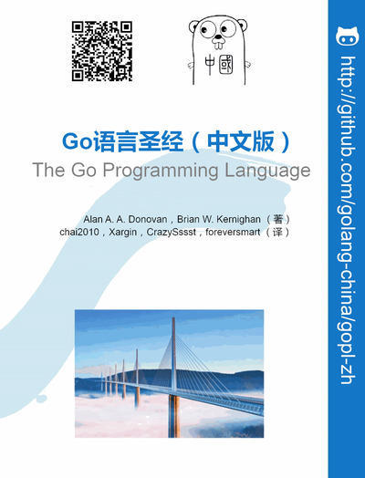

Go语言圣经 [《The Go Programming Language》](http://www.gopl.io) 中文版本学习笔记。

好记性不如烂笔头，本库整理记录自己在学习中文版《The Go Programming Language》的一些笔记，笔记的风格比较随意，主要是根据个人的编程经验将一些常用的，重要的或者和其他语言差异较大的地方使用一种短句式的形式进行记录，并且配以代码片段用于理解。
该代码库是每个章节个人觉得有用或者能够综合理解一些知识的代码示例。

### 目录
1. 前言
2. 入门
   * Note: [Golang第一章:入门](http://kdf5000.com/2017/02/25/Golang第一章-入门/)
   * Code: [ch1](src/ch1)
3. 程序结构
   * Note: [Golang第二章:程序结构](http://kdf5000.com/2017/02/25/Golang第二章-程序结构/)
   * Code: [ch2](src/ch2)
4. 基础数据类型
   * Note: [Golang第三章:基础数据类型](http://kdf5000.com/2017/02/25/Golang第三章-基础数据类型//)
   * Code: [ch3](src/ch3)
5. 复合数据类型
   * Note: [Golang第四章:复合数据结构](http://kdf5000.com/2017/02/25/Golang第四章-复合数据类型/)
   * Code: [ch4](src/ch4)
6. 函数
   * Note: [Golang第五章:函数](http://kdf5000.com/2017/03/11/Golang第五章-函数/)
   * Code: [ch5](src/ch5)
7. 方法
   * Note: [Golang第六章:方法](http://kdf5000.com/2017/03/15/Golang第六章-方法/)
   * Code: [ch6](src/ch6)
8. 接口
   * Note: [Golang第七章:接口](http://kdf5000.com/2017/04/24/Golang第七章-接口/)
   * Code: [ch7](src/ch7)
9. Goroutines和Channels
   * Note: Golang第八章:Goroutines和Channels
   * Code: ch8
10. 基于共享变量的并发
   * Note: Golang第九章:基于共享变量的并发
   * Code: ch9
11. 包和工具
   * Note: Golang第十章:包和工具
   * Code: ch10
12. 测试
   * Note: [Golang第十一章:测试](http://kdf5000.com/2017/03/28/Golang第十一章-测试/)
   * Code: [ch11](src/ch11)
13. 反射
   * Note: Golang第十二章:反射
   * Code: ch12
14. 底层编程
   * Note: Golang第十三章:底层编程
   * Code: ch13
